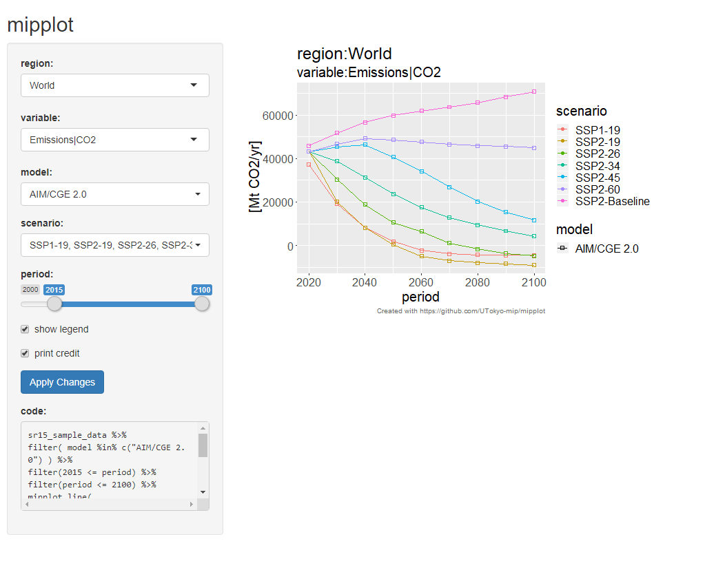
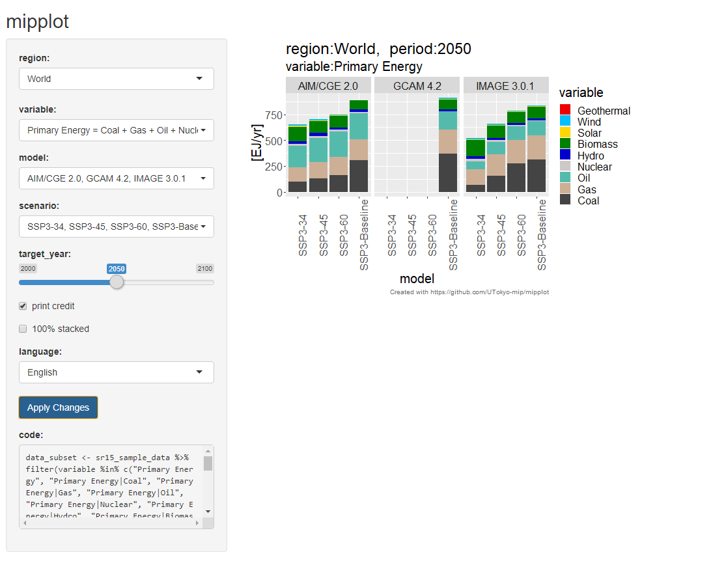
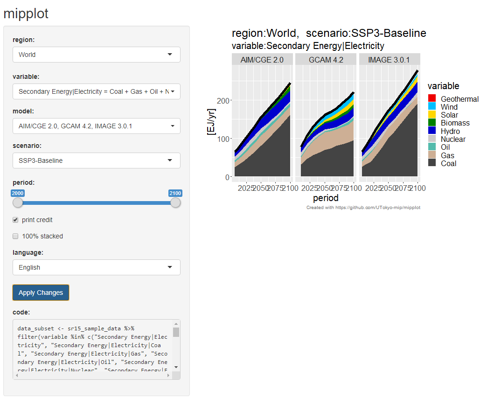

```{r setup, include = FALSE}
knitr::opts_chunk$set(
  collapse = TRUE,
  comment = "#>"
)
```

## 概要

`mipplot` パッケージは IAMC template format のデータを可視化するための `R` パッケージです。

この vignette では `mipplot` パッケージの基本機能を紹介します。

## 利用するデータ

この vignette では SR1.5 データのサブセットを使用します。
このデータは `mipplot` パッケージに含まれており、別途ダウンロードする必要はありません。

## load library

`mipplot` パッケージと `tidyverse`パッケージを読み込みます。

```{r, message=FALSE, warning=FALSE}
library(mipplot)
library(tidyverse)
```

## load sample data

`mipplot` パッケージに付属の SR1.5 のサブセット データは `mipplot::sr15_sample_data` という名前でアクセスできます。中身を見てみましょう。

```{r}
sr15_sample_data
```

中身は `tibble` 形式のデータです。ここには `model`, `scenario`, `region`, `variable`, `unit`, `period`, `value` というデータが保存されています。

なお、ファイルから別のデータを読み込むには、以下のようにします。

```{r, eval=FALSE}
iamc_data <- mipplot_read_iamc("path_to_data.csv")
```

データに含まれるモデルの一覧を確認しましょう。

```{r}
sr15_sample_data$model %>% levels
```

シナリオの一覧を確認しましょう。

```{r}
sr15_sample_data$scenario %>% levels
```

地域の一覧を確認しましょう。

```{r}
sr15_sample_data$region %>% levels
```

変数の一覧を確認しましょう。

```{r}
sr15_sample_data %>% select(variable, unit) %>% distinct
```

## データのフィルタリング

`SSP2` のシナリオを含むモデルのみ抽出を例に、データのフィルタリングの方法を説明します。

```{r}
sr15_sample_data %>% 
  filter(str_detect(scenario, "^SSP2")) %>%
  select(model, scenario) %>% distinct
```

`str_detect` 関数に与えられている `"^SSP2"` は正規表現と呼ばれています。
`"^"` は文頭を表し、"^SSP2" という正規表現は、
"SSP2" から始まる文字列であるかをチェックするという意味になります。

`distinct` は、データの重複を除く関数です。

次に、 **Secondary Energy|Electricity|** 以下の変数の一覧を抽出してみましょう。

"|" は正規表現の中で特別な意味を持つので、これを検索するには"\\|" のようにしなければなりません。これをエスケープするといいます。

```{r}
sr15_sample_data %>% 
  filter(str_detect(variable, "^Secondary Energy\\|Electricity\\|")) %>% 
  select(variable) %>%
  distinct
```

## Visualization with interactive tool

`mipplot` の対話的インターフェースを使って、データのフィルタリングと可視化を行ってみましょう。

### line plot

まず line plot を行います。line plot を行うには以下のようにします。

```{r, eval=FALSE}
mipplot_interactive_line(sr15_sample_data)
```

すると、以下のような画面が表示されます。

```{r, echo=FALSE, out.width="100%"}

```

各種の条件を選択して、グラフをプロットしてください。

なお、画面にはグラフを再現するための R のコードが表示されます。
これをコピー＆ペーストすると、以下のようにプロットを編集できます。

```{r, fig.width=10, fig.height=7, out.width="100%"}
data_subset <- sr15_sample_data %>%
  filter( model %in% c("AIM/CGE 2.0", "GCAM 4.2", "IMAGE 3.0.1") ) %>%
  filter(2000 <= period) %>%
  filter(period <= 2100)

mipplot_line(
  data_subset,
  variable = c("Emissions|CO2"),
  scenario = c("SSP3-34", "SSP3-45", "SSP3-60", "SSP3-Baseline"),
  region = c("World"),
  legend = TRUE,
  language = 'en')[[1]]

```

### bar plot

次に、bar plot を行います。bar plot には、ルール表が必要なため、
AR5 用のルール `ar5_db_sample_rule_table` を流用します。

```{r, eval=FALSE}
mipplot_interactive_bar(sr15_sample_data, ar5_db_sample_rule_table)
```

```{r, echo=FALSE, out.width="100%"}

```

画面にはプロットを再現するための R のコードが表示されます。
これをコピー＆ペーストすると、以下のようにプロットを編集できます。

```{r, fig.width=10, fig.height=7, out.width="100%"}
data_subset <- sr15_sample_data %>%
  filter(variable %in% c("Primary Energy", "Primary Energy|Coal", "Primary Energy|Gas", "Primary Energy|Oil", "Primary Energy|Nuclear", "Primary Energy|Hydro", "Primary Energy|Biomass", "Primary Energy|Solar", "Primary Energy|Wind", "Primary Energy|Geothermal", "Primary Energy|Ocean")) %>%
  filter(model %in% c("AIM/CGE 2.0", "GCAM 4.2", "IMAGE 3.0.1")) %>%
  filter(scenario %in% c("SSP3-34", "SSP3-45", "SSP3-60", "SSP3-Baseline"))

mipplot_bar(data_subset, ar5_db_sample_rule_table,
  region = c("World"),
  target_year = 2050,
  one_hundred_percent_stacked = FALSE,
  language = 'en')[[1]]

```


### area plot

area plot を行います。area plot にもルールが必要なため、
AR5 用のルール `ar5_db_sample_rule_table` を流用します。

```{r, eval=FALSE}
mipplot_interactive_area(sr15_sample_data, ar5_db_sample_rule_table)
```

```{r, echo=FALSE, out.width="100%"}

```

画面にはプロットを再現するための R のコードが表示されます。
これをコピー＆ペーストすると、以下のようにプロットを編集できます。

```{r, fig.width=10, fig.height=7, out.width="100%"}
data_subset <- sr15_sample_data %>%
  filter(variable %in% c("Secondary Energy|Electricity", "Secondary Energy|Electricity|Coal", "Secondary Energy|Electricity|Gas", "Secondary Energy|Electricity|Oil", "Secondary Energy|Electricity|Nuclear", "Secondary Energy|Electricity|Hydro", "Secondary Energy|Electricity|Biomass", "Secondary Energy|Electricity|Solar", "Secondary Energy|Electricity|Wind", "Secondary Energy|Electricity|Geothermal", "Secondary Energy|Electricity|Ocean")) %>%
  filter(model %in% c("AIM/CGE 2.0", "GCAM 4.2", "IMAGE 3.0.1")) %>%
  filter(2000 <= period) %>%
  filter(period <= 2100)

mipplot_area(data_subset, ar5_db_sample_rule_table,
  region = c("World"),
  scenario = c("SSP3-Baseline"),
  one_hundred_percent_stacked = FALSE,
  language = 'en')[[1]]
```

## 別の言語での出力

これまで、英語でのプロットを行ってきましたが、
これ以外にも中国語（簡体字）、中国語（繁体字）、日本語、スペイン語での
プロットが可能です。

これまでのプロットでは、すべて `language = "en"` (English) と指定していたので、
これを例えば以下のように置き換えます。


```{r, warning=FALSE, fig.width=10, fig.height=7, out.width="100%"}
data_subset <- sr15_sample_data %>%
  filter(variable %in% c("Secondary Energy|Electricity", "Secondary Energy|Electricity|Coal", "Secondary Energy|Electricity|Gas", "Secondary Energy|Electricity|Oil", "Secondary Energy|Electricity|Nuclear", "Secondary Energy|Electricity|Hydro", "Secondary Energy|Electricity|Biomass", "Secondary Energy|Electricity|Solar", "Secondary Energy|Electricity|Wind", "Secondary Energy|Electricity|Geothermal", "Secondary Energy|Electricity|Ocean")) %>%
  filter(model %in% c("AIM/CGE 2.0", "GCAM 4.2", "IMAGE 3.0.1")) %>%
  filter(2000 <= period) %>%
  filter(period <= 2100)

mipplot_area(data_subset, ar5_db_sample_rule_table,
  region = c("World"),
  scenario = c("SSP3-Baseline"),
  one_hundred_percent_stacked = FALSE,
  language = 'jp')[[1]]  # <--------------- ここを置き換えました
```


設定可能な言語と言語コードの対応表は以下の通りです。

| 言語   |  言語コード  |
| ---- | ---- |
|  英語  |  en  |
|  中国語(簡体字)  |  zh-cn  |
|  中国語(繁体字)  |  zh-tw  |
|  日本語  |  jp  |
|  スペイン語  |  es  |


## PDF ファイルへの出力

画像を PDF ファイルに出力するには、以下のようにします。

```{r, eval=FALSE, fig.width=10}
data_subset <- sr15_sample_data %>%
  filter(variable %in% c("Secondary Energy|Electricity", "Secondary Energy|Electricity|Coal", "Secondary Energy|Electricity|Gas", "Secondary Energy|Electricity|Oil", "Secondary Energy|Electricity|Nuclear", "Secondary Energy|Electricity|Hydro", "Secondary Energy|Electricity|Biomass", "Secondary Energy|Electricity|Solar", "Secondary Energy|Electricity|Wind", "Secondary Energy|Electricity|Geothermal", "Secondary Energy|Electricity|Ocean")) %>%
  filter(model %in% c("AIM/CGE 2.0", "GCAM 4.2", "IMAGE 3.0.1")) %>%
  filter(2000 <= period) %>%
  filter(period <= 2100)

# グラフを変数に保存します。
graph <- mipplot_area(data_subset, ar5_db_sample_rule_table,
  region = c("World"),
  scenario = c("SSP3-Baseline"),
  one_hundred_percent_stacked = FALSE,
  language = 'zh-cn')[[1]]

# グラフを保存した変数を mipplot_print_pdf 関数に与えます。
mipplot_print_pdf(graph)

```

するとファイルを保存するダイアログが表示され、
PDF ファイルとして保存できます。

